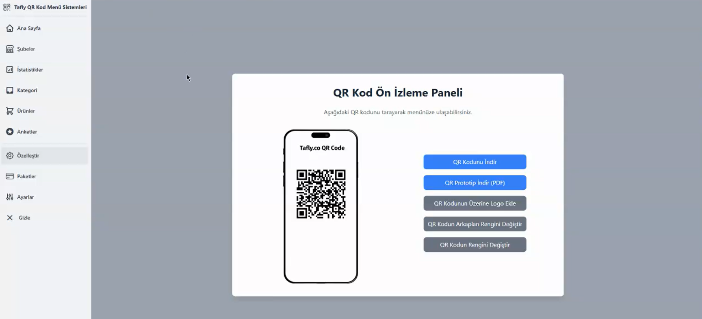

<article style="font-family: Arial, sans-serif; line-height: 1.6; max-width: 900px; margin: auto;">
    <h1>Tafly QR Menu</h1>
    <h2>🇬🇧 English</h2>
  

    <strong>Tafly</strong> is a flexible and modern system that allows businesses to create <strong>QR-based online menus</strong>. It can be used across various industries from restaurants to salons.
  

  <ul>
    <li>Elegant and fast frontend built with Vue.js</li>
    <li>Robust backend powered by Express.js and Node.js</li>
    <li>Flexible data management with MongoDB</li>
    <li>Secure user authentication with JWT</li>
    <li>PDF support via PDF.js integration</li>
    <li>Fast package management using Yarn</li>
  </ul>

  <h3>🔧 Setup</h3>
  <pre><code>npm install
npm run serve
cd server
node app.js</code></pre>

  <h3>🖼️ Sample Image</h3>
  
  

  <h2>🇹🇷 Türkçe</h2>
  

    <strong>Tafly</strong>, işletmelere özel <strong>QR kodlu online menüler</strong> oluşturma imkânı sunan modern ve esnek bir sistemdir. Restoranlardan kuaför salonlarına kadar birçok sektörde kullanılabilir. 
  

  <ul>
    <li>Vue.js ile oluşturulmuş şık ve hızlı frontend</li>
    <li>Express.js ve Node.js destekli güçlü backend</li>
    <li>MongoDB ile esnek veri yönetimi</li>
    <li>JWT ile güvenli kullanıcı doğrulama</li>
    <li>PDF.js entegrasyonu ile PDF menü desteği</li>
    <li>Yarn ile hızlı bağımlılık yönetimi</li>
  </ul>

  <h3>🔧 Kurulum</h3>
  <pre><code>npm install
npm run serve
cd server
node app.js</code></pre>

  <h3>🖼️ Örnek Görsel</h3>
  

</article>
